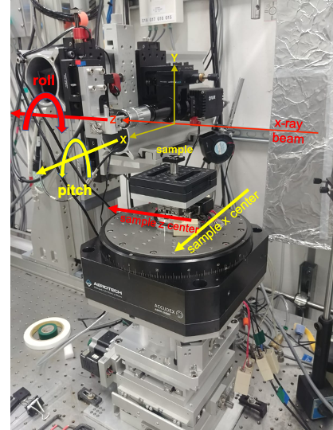

=====
align
=====

**align** is a command-line tool that automatically determines the detector pixel size, positions the scintillator at the lens focal plane, aligns the rotation axis tilt and pitch, and centers the rotation axis within the detector’s field of view.

**align** works in combination with a regular sample mounted on top of the rotary stage, ensuring it remains within the field of view when the rotation axis is at 0° and 180°. Alternatively, a high-contrast sample such as a wooden stick can also be used effectively.

Installation
============

::

    $ git clone https://github.com/xray-imaging/align.git
    $ cd align
    $ pip install .

in a prepared conda environment.

Usage
=====

The first step is to measure the image pixel size. Install the test sample on the rotary stage and select a lens (for example, 10×). Next, determine the X position where the sample moves out of the field of view (for instance, –7). This position will be used to acquire a white-field image, while the in-position (e.g., 0) corresponds to the sample in the field of view. Both images are required because align operates on normalized images.

The pixel size is determined by acquiring two images: one at sample X = 0 mm and another at sample X = 0.1 mm, then measuring the horizontal shift between the two images. In the example below we use a 10x objective with a FLIR model Oryx ORX-10G-310S9M. The measured pixel size is 0.340472 μm/pixel.

Then, run the following command::

    (ops) 2bmb@arcturus$ align resolution --sample-in-x 0 --sample-out-x -7
    2025-10-22 10:15:21,333 - Saving log at /home/beams/2BMB/logs/adjust_2025-10-22_10_15_21.log
    2025-10-22 10:15:21,387 - Detector FLIR model Oryx ORX-10G-310S9M:
    2025-10-22 10:15:21,389 - *** The detector with EPICS IOC prefix 2bmSP2: and serial number 22150530 is on
    2025-10-22 10:15:21,389 -  
    2025-10-22 10:15:21,389 -   *** init FLIR camera
    2025-10-22 10:15:21,389 -   *** *** set detector to idle
    2025-10-22 10:15:21,399 -   *** *** set detector to idle:  Done
    2025-10-22 10:15:22,400 -   *** *** set trigger mode to Off
    2025-10-22 10:15:22,477 -   *** *** set trigger mode to Off: done
    2025-10-22 10:15:23,478 -   *** *** set image mode to single
    2025-10-22 10:15:23,519 -   *** *** set image mode to single: done
    2025-10-22 10:15:23,519 -   *** *** set cam display to 1
    2025-10-22 10:15:23,520 -   *** *** set cam display to 1: done
    2025-10-22 10:15:23,520 -   *** *** set cam acquire
    2025-10-22 10:15:23,706 -   *** *** set cam acquire: done
    2025-10-22 10:15:23,706 -   *** init FLIR camera: Done!
    2025-10-22 10:15:23,706 -  
    2025-10-22 10:15:23,706 -   *** setup FLIR camera
    2025-10-22 10:15:37,998 -   *** setup FLIR camera: Done!
    2025-10-22 10:15:38,000 -  
    2025-10-22 10:15:38,001 -   *** close_shutters
    2025-10-22 10:15:42,050 -   *** close_shutter: Done!
    2025-10-22 10:15:42,051 -   ***  *** acquire dark
    2025-10-22 10:15:42,051 -   ***  *** taking a single image
    2025-10-22 10:15:44,785 -  
    2025-10-22 10:15:44,785 -   *** open_shutters
    2025-10-22 10:15:46,039 -   *** open_shutter: Done!
    2025-10-22 10:15:46,039 - move_sample_out axis: horizontal
    2025-10-22 10:15:46,039 -       *** *** Move Sample X in at: -7.000000
    2025-10-22 10:15:53,391 -   ***  *** acquire white
    2025-10-22 10:15:53,392 -   ***  *** taking a single image
    2025-10-22 10:15:55,978 - move_sample_in axis: horizontal
    2025-10-22 10:15:55,978 -       *** *** Move Sample X in at: 0.000000
    2025-10-22 10:16:03,419 - Detector FLIR model Oryx ORX-10G-310S9M:
    2025-10-22 10:16:03,420 -  *** Find resolution ***
    2025-10-22 10:16:03,421 -   *** First image at X: 0.000000 mm
    2025-10-22 10:16:03,421 -   *** acquire first image
    2025-10-22 10:16:03,421 -   ***  *** taking a single image
    2025-10-22 10:16:06,099 -   ***  *** image size: [4852, 6464]
    2025-10-22 10:16:06,309 -   *** Second image at X: 0.100000 mm
    2025-10-22 10:16:06,802 -   *** acquire second image
    2025-10-22 10:16:06,802 -   ***  *** taking a single image
    2025-10-22 10:16:09,480 -   ***  *** image size: [4852, 6464]
    2025-10-22 10:16:09,679 -   *** moving X stage back to 0.000000 mm position
    2025-10-22 10:16:09,679 - move_sample_in axis: horizontal
    2025-10-22 10:16:09,679 -       *** *** Move Sample X in at: 0.000000
    2025-10-22 10:16:15,831 -   *** shift X: 293.709991, Y: -0.030000
    2025-10-22 10:16:15,832 -   *** found resolution 0.340472 μm/pixel

You can configure how the white-field images are collected by setting the --flat-field-axis option to horizontal, vertical, or both.

Once the pixel size has been measured, you can proceed to align the rotation axis with respect of the detector vertical pixel columns by using::

    (ops) 2bmb@arcturus$ align rotation

    2025-10-22 10:35:21,906 - Saving log at /home/beams/2BMB/logs/adjust_2025-10-22_10_35_21.log
    2025-10-22 10:35:21,967 - Detector FLIR model Oryx ORX-10G-310S9M:
    2025-10-22 10:35:21,968 - *** The detector with EPICS IOC prefix 2bmSP2: and serial number 22150530 is on
    2025-10-22 10:35:21,968 -  
    2025-10-22 10:35:21,968 -   *** init FLIR camera
    2025-10-22 10:35:21,968 -   *** *** set detector to idle
    2025-10-22 10:35:21,980 -   *** *** set detector to idle:  Done
    2025-10-22 10:35:22,980 -   *** *** set trigger mode to Off
    2025-10-22 10:35:23,051 -   *** *** set trigger mode to Off: done
    2025-10-22 10:35:24,051 -   *** *** set image mode to single
    2025-10-22 10:35:24,093 -   *** *** set image mode to single: done
    2025-10-22 10:35:24,093 -   *** *** set cam display to 1
    2025-10-22 10:35:24,093 -   *** *** set cam display to 1: done
    2025-10-22 10:35:24,093 -   *** *** set cam acquire
    2025-10-22 10:35:24,273 -   *** *** set cam acquire: done
    2025-10-22 10:35:24,273 -   *** init FLIR camera: Done!
    2025-10-22 10:35:24,273 -  
    2025-10-22 10:35:24,273 -   *** setup FLIR camera
    2025-10-22 10:35:38,585 -   *** setup FLIR camera: Done!
    2025-10-22 10:35:38,593 -  
    2025-10-22 10:35:38,593 -   *** close_shutters
    2025-10-22 10:35:42,169 -   *** close_shutter: Done!
    2025-10-22 10:35:42,169 -   ***  *** acquire dark
    2025-10-22 10:35:42,169 -   ***  *** taking a single image
    2025-10-22 10:35:44,873 -  
    2025-10-22 10:35:44,873 -   *** open_shutters
    2025-10-22 10:35:46,165 -   *** open_shutter: Done!
    2025-10-22 10:35:46,165 - move_sample_out axis: horizontal
    2025-10-22 10:35:46,166 -       *** *** Move Sample X in at: -7.000000
    2025-10-22 10:35:53,504 -   ***  *** acquire white
    2025-10-22 10:35:53,505 -   ***  *** taking a single image
    2025-10-22 10:35:56,143 - move_sample_in axis: horizontal
    2025-10-22 10:35:56,143 -       *** *** Move Sample X in at: 0.000000
    2025-10-22 10:36:03,472 -  
    2025-10-22 10:36:03,472 -   *** close_shutters
    2025-10-22 10:36:06,170 -   *** close_shutter: Done!
    2025-10-22 10:36:06,170 -   ***  *** acquire dark
    2025-10-22 10:36:06,170 -   ***  *** taking a single image
    2025-10-22 10:36:08,876 -  
    2025-10-22 10:36:08,876 -   *** open_shutters
    2025-10-22 10:36:10,151 -   *** open_shutter: Done!
    2025-10-22 10:36:10,151 - move_sample_out axis: horizontal
    2025-10-22 10:36:10,152 -       *** *** Move Sample X in at: -7.000000
    2025-10-22 10:36:17,461 -   ***  *** acquire white
    2025-10-22 10:36:17,461 -   ***  *** taking a single image
    2025-10-22 10:36:20,120 - move_sample_in axis: horizontal
    2025-10-22 10:36:20,120 -       *** *** Move Sample X in at: 0.000000
    2025-10-22 10:36:27,504 - Detector FLIR model Oryx ORX-10G-310S9M:
    2025-10-22 10:36:27,505 -  *** Aligning rotation ***
    2025-10-22 10:36:27,505 -   *** sample 0
    2025-10-22 10:36:27,506 -   ***  *** moving rotary stage to 0.000000 deg position ***
    2025-10-22 10:36:31,623 -   ***  *** acquire sample at 0.000000 deg position ***
    2025-10-22 10:36:31,624 -   ***  *** taking a single image
    2025-10-22 10:36:34,421 -   ***  *** image size: [4852, 6464]
    2025-10-22 10:36:34,612 -   *** sample 1
    2025-10-22 10:36:34,612 -   ***  *** moving rotary stage to 180.000000 deg position ***
    2025-10-22 10:36:38,665 -   ***  *** acquire sample at 180.000000 deg position ***
    2025-10-22 10:36:38,665 -   ***  *** taking a single image
    2025-10-22 10:36:41,378 -   ***  *** image size: [4852, 6464]
    2025-10-22 10:36:48,498 -   
    2025-10-22 10:36:48,498 -   *** rotation axis shift -3.415000 pixels ***
    2025-10-22 10:36:48,498 -   *** rotation axis shift -0.001162 mm ***
    2025-10-22 10:36:48,498 -   *** Additional values:  ***
    2025-10-22 10:36:48,498 -   *** rotation axis top    -2.955000 pixels ***
    2025-10-22 10:36:48,498 -   *** rotation axis center -3.590000 pixels ***
    2025-10-22 10:36:48,498 -   *** rotation axis bottom -3.430000 pixels ***
    2025-10-22 10:36:48,498 -   *** Move rotation axis to middle?
       *** Yes or No (Y/N):

This command acquires two images of the sample: one at 0° and another at 180°. It then analyzes these images to determine the position of the rotation axis at three points — the top, middle, and bottom of the image.

If the rotation axis is perfectly aligned with the detector columns, the measured axis positions at all three locations will be identical. If discrepancies are observed, the camera rotation must be adjusted. This adjustment is motorized and can be performed through the Optique Peter instrument controls.

Once this is completed, you can proceed to align the vertical stage of the hexapod. To do this, move the hexapod Y axis up by, for example, +8 mm, and run::

    (ops) 2bmb@arcturus$ align rotation
    ...
    2025-10-22 11:22:12,618 -   *** rotation axis shift -0.820000 pixels ***
    2025-10-22 11:22:12,618 -   *** rotation axis shift -0.000279 mm ***
    2025-10-22 11:22:12,619 -   *** Additional values:  ***
    2025-10-22 11:22:12,619 -   *** rotation axis top    -0.635000 pixels ***
    2025-10-22 11:22:12,619 -   *** rotation axis center -0.665000 pixels ***
    2025-10-22 11:22:12,619 -   *** rotation axis bottom -1.190000 pixels ***

Next, move the hexapod Y axis down by, for example, –8 mm, and run the same command again::

    (ops) 2bmb@arcturus$ align rotation
    ...
    2025-10-22 11:25:08,591 -   *** rotation axis shift 5.055000 pixels ***
    2025-10-22 11:25:08,591 -   *** rotation axis shift 0.001719 mm ***
    2025-10-22 11:25:08,591 -   *** Additional values:  ***
    2025-10-22 11:25:08,591 -   *** rotation axis top    5.430000 pixels ***
    2025-10-22 11:25:08,591 -   *** rotation axis center 4.945000 pixels ***
    2025-10-22 11:25:08,591 -   *** rotation axis bottom 4.840000 pixels ***

If there is a difference in the measured rotation axis position between the two runs, you will need to adjust the hexapod roll until the measurements are consistent.

.. warning:: Make sure the hexapod X can still reach the white field position when its Y is in the up/down location.

To list of all available options::

    $ align  -h

Configuration File
------------------

align parameters are stored in **align.conf**. You can create a template with::

    $ align init

**align.conf** is constantly updated to keep track of the last stored parameters, as initalized by **init** or modified by setting a new option value. 

Beamline customization
======================

To run **align** on a different beamline you need to change the EPICS pv names associated to your instrument. This can be done at run time by setting::

    --focus-pv-name FOCUS_PV_NAME
                        focus pv name (default: 2bma:m41)
    --image-pixel-size-pv-name IMAGE_PIXEL_SIZE_PV_NAME
                image pixel sizef pv name (default:
                2bma:TomoScan:ImagePixelSize)
    --rotation-pv-name ROTATION_PV_NAME
                rotation pv name (default: 2bma:m82)
    --sample-pitch-pv-name SAMPLE_PITCH_PV_NAME
                sample pitch pv name (default: 2bma:m50)
    --sample-roll-pv-name SAMPLE_ROLL_PV_NAME
                sample roll pv name (default: 2bma:m51)
    --sample-x-top-pv-name sample_x_top_pv_name
                sample x center pv name (default: 2bmS1:m2)
    --sample-x-pv-name SAMPLE_X_PV_NAME
                sample x pv name (default: 2bma:m49)
    --sample-y-pv-name SAMPLE_Y_PV_NAME
                sample y pv name (default: 2bma:m20)
    --sample-z-top-pv-name sample_z_top_pv_name
                sample z center pv name (default: 2bmS1:m1)
    --shutter-close-pv-name SHUTTER_CLOSE_PV_NAME
                shutter close pv name (default: 2bma:A_shutter:close)
    --shutter-open-pv-name SHUTTER_OPEN_PV_NAME
                shutter open pv name (default: 2bma:A_shutter:open)
    --shutter-status-pv-name SHUTTER_STATUS_PV_NAME
                shutter status pv name (default:
            PA:02BM:STA_A_FES_OPEN_PL)
    --shutter-close-value SHUTTER_CLOSE_VALUE
                value to set the shutter-close-pv-name to close the
                shutter (default: 1)
    --shutter-open-value SHUTTER_OPEN_VALUE
                value to set the shutter-open-pv-name to open the
                shutter (default: 1)
    --shutter-status-close-value SHUTTER_STATUS_CLOSE_VALUE
                shutter close status value (default: 0)
    --shutter-status-open-value SHUTTER_STATUS_OPEN_VALUE
                shutter open status value (default: 1)
    --detector-prefix DETECTOR_PREFIX

or by changing the default pv_name values in the align/config.py file.
